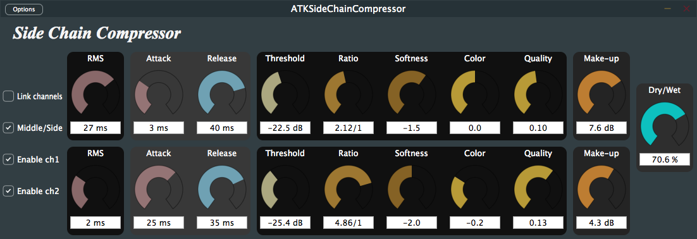

= ATKSideChainCompressor 3.0.0
Matthieu Brucher <matthieu.brucher@gmail.com>
:doctype: book
:source-highlighter: coderay
:listing-caption: Listing
// Uncomment next line to set page size (default is Letter)
//:pdf-page-size: A4

*ATKSideChainCompressor* is a free Open Source plugin for stereo track dynamic compression. It features soft to hard knee and colored gain transfert function.

== Usage

Here is how the parameters interact with the plugin:

[square]
* *link* allows to link the two channels together
* *middleside* switches the stereo channels processing to middle/side
* *enableCh1* enables channel 1 compressor
* *enableCh2* enables channel 2 compressor
* *Dry/Wet* balances the amount of processed signal versus input signal

Each channel has the following parameters (stereo and middle/side mode):
* *RMS* changes the size of the window-like RMS computation.
* *Attack* handles the speed at which the attack-release filter increases its detected value
* *Release* handles the speed at which the attack-release filter decreases its detected value
* *Threshold* modifies the threshold from which the compressor starts acting
* *Ratio* modifies the slope of the compression curve. The higher the ratio, the more the compression. Ratios below 1 indicate expansion.
* *Softness* is a comprise between soft knee and hard knee
* *Make-up* Allows to increase the compressor output volume

== Bugs

There shouldn’t be bugs, but you never know. Please contact me or leave a message on http://www.audio-tk.com[Audio ToolKit web site] or on http://blog.audio-tk.com/tags/atksidechaincompressor/[my blog, on the announcement page].
