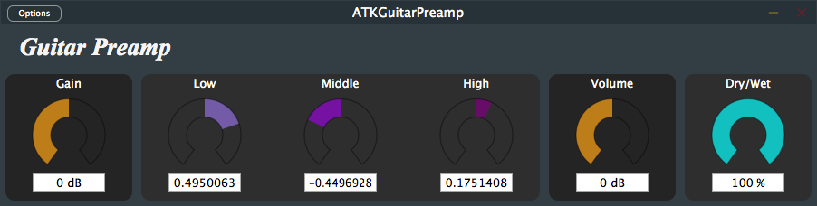

= ATKGuitarPreamp
Matthieu Brucher <matthieu.brucher@gmail.com>
:doctype: book
:source-highlighter: coderay
:listing-caption: Listing
// Uncomment next line to set page size (default is Letter)
//:pdf-page-size: A4

*ATKGuitarPreamp* is a free Open Source plugin modeling a guitar preamplifier (inverter from the first stage of an AC30) followed by a tone stack inspired by the JCM800.

== Usage

Here is how the parameters interact with the plugin:

[square]
* *Gain* changes the amount of distortion you get from the preamplifier by increasing the input signal level,
* *Low* handles the amount of low frequencies in the tone stack
* *Middle* handles the amount of middle frequencies in the tone stack
* *High* handles the amount of high frequencies in the tone stack
* *Volume* changes the output volume, before the dry/wet knob
* *Dry/Wet* balances the amount of processed signal versus input signal

== Bugs

There shouldn’t be bugs, but you never know. Please contact me or leave a message on http://www.audio-tk.com[Audio ToolKit web site] or on http://blog.audio-tk.com/tags/atkguitarpreamp/[my blog, on the announcement page].
